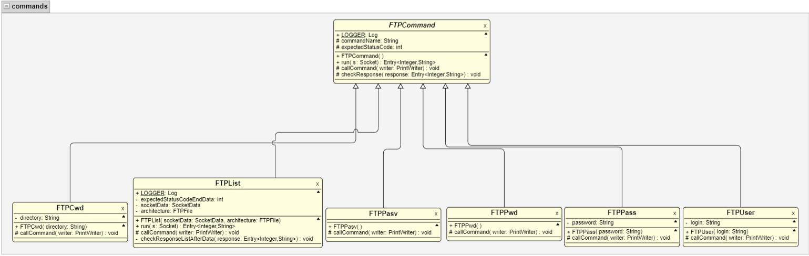
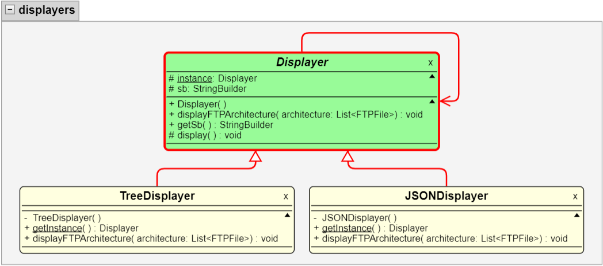

# Implémentation d'une commande Tree pour lister le contenu d'un serveur FTP
## Lucas Plé 
## 03/01/2023

## Introduction
Ce logiciel permet de se connecter à un serveur FTP et de lister sous la forme d'un arbre les fichiers présents sur le serveur. L'affichage de l'architecture des fichiers du serveur s'inspire fortement de la commande UNIX [tree](https://linux.die.net/man/1/tree).

Voici les commandes élémentaires afin d'utiliser le projet :

### Compiler le projet 
```
mvn test clean compile assembly:single
```

### Générer la Javadoc
```
mvn javadoc:javadoc
```

### Accéder à la javadoc 
```
firefox target/site/apidocs/index.html
```

### Lancer le projet 
```
java -jar target/TreeFTP.jar <address> [(OPTION) (VALEUR)]

Options disponibles :
-u : spécifier un login pour la connexion au serveur 
-p : spécifier un mot de passe pour la connexion au serveur FTP
-d : spécifier une profondeur d'exploration du serveur (valeur par défaut arbitraire à 99, normalement suffisamment grande pour parcourir l'ensemble d'un serveur FTP)

Veillez à toujours spécifier une valeur après ces arguments. 
Il existe également l'argument --json qui lui ne doit pas avoir de valeur à sa suite. Il peut être placé n'importe où après l'adresse du serveur sur lequel le programme doit se connecter. Il permet d'afficher l'arborescence du serveur FTP au format JSON.

Par exemple pour se connecter au serveur `ftp.ubuntu.com` avec l'utilisateur 'Jean' et le mot de passe 'bonjour' :
java -jar target/TreeFTP.jar ftp.ubuntu.com -u Jean -p bonjour

Avec une profondeur demandée de 5 :
java -jar target/TreeFTP.jar ftp.ubuntu.com -u Jean -p bonjour -d 5

Avec l'affichage au format JSON :
java -jar target/TreeFTP.jar ftp.ubuntu.com --json -u Jean -p bonjour -d 5
```

## Architecture
Il y a une classe abstraite dans ce projet : la classe `FTPCommand`. Cette classe définit simplement une commande FTP quelconque. Elle permet ainsi de définir dans les classes qui l'étendent différentes commandes FTP. Cette classe abstraite fournit deux méthodes : `run` et `checkResponse`. La méthode `run` appelle la méthode `checkResponse` et permet, comme son nom l'indique de vérifier si la réponse du serveur suite à l'exécution de la commande est bien celle attendue. Il existe également une méthode abstraite que chaque sous classe doit implémenter qui est la méthode `callCommand`.  C'est dans cette méthode que sera construite et envoyée au serveur la chaîne de caractères définissant un appel aux méthodes FTP. C'est dans cette optique qu'il existe également les deux attributs `commandName` et `expectedStatusCode` qui sont renseignés dans chaque sous-classes. Ils permettent de construire l'appel à la méthode et de vérifier que l'appel s'est correctement fait sur le serveur. Cette architecture permet alors de créer n'importe quelle méthode FTP en créant une classe qui étend `FTPCommand` et qui implémente la méthode `callCommand`. Pour des commandes plus spécifiques comme `LIST`, il est possible de surcharger la méthode `run` au besoin. Dans le cas de `LIST` par exemple, il s'agit de pouvoir vérifier le code renvoyé lorsqu'on demande à lister les fichiers, ce-dernier indiquant que le flux commence à être envoyé sur le port spécifié au retour de la commande `PASV` effectuée juste avant. Une fois que toutes les données ont été envoyées sur le canal de données, le serveur renvoie un code sur le canal de contrôle afin de spécifier que l'envoi est terminé. Il faut donc effectuer deux contrôles de réponses pour cette méthode. C'est pourquoi la méthode `run` a été surchargée pour prendre en compte cette spécificité.

La partie qui gère l'affichage de ce programme est constituée d'une classe abstraite `Displayer` ayant pour attribut un ovjet de type `Displayer` et un `StringBuilder`. Elle contient également une méthode abstraite `displayFTPArchitecture` que les sous-classes doivent implémenter et qui permet d'afficher une arborescence de fichier. Elle possède également une méthode `display` qui va afficher sur la sortie standard le contenu du `StringBuilder`. L'attribut `instance` permet d'implanter le design pattern [Singleton](https://fr.wikipedia.org/wiki/Singleton_(patron_de_conception)) dans les sous-classes. Ces sous-classes permettent d'adapter l'affichage de l'architecture. Par exemple, dans l'état actuel du projet, il existe deux façons d'afficher l'architecture : sous la forme d'un arbre comme la commande `tree` ou en format JSON. Si l'option pour afficher en JSON est activée, le code chargera l'instance du Displayer permettant d'afficher en JSON. A l'inverse, il chargera le Displayer permettant d'afficher sous la forme d'un arbre. 

## Code Samples et UML
Le premier exemple de code concerne la partie architecture expliquée juste avant. Voici le code de la fonction `run` de la classe abstraite `FTPCommand`.
```java
public Entry<Integer, String> run(Socket s) throws CommandFailedException {
    // on récupére les flux d'entrées sorties de la socket pour communiquer avec le serveur
    BufferedReader reader = SocketUtils.getReadableInputStream(s);
    PrintWriter writer = SocketUtils.getWritableOutputStream(s);
    
    // on appelle la méthode 'callCommand' qui doit être définie pour chaque méthode FTP
    this.callCommand(writer);
    // on récupére la réponse FTP sous la forme d'un couple <entier, chaine de caractères> pour isoler le code de la réponse
    Entry<Integer, String> response = FTPUtils.getFTPResponse(reader);
    // on contrôle que le code renvoyé par le serveur est bien le code attendu lors du succès de la méthode FTP qu'on appelle
    // le code attendu est spécifié dans chaque sous-classe
    checkResponse(response);
    
    return response;
}
```

La méthode suivante est la méthode qui est appelée par la fonction `Main` pour générer l'arbre :
```java
public static void handle(String address, int port, String login, String password, int maxDepth, boolean json) throws CommandFailedException {
    [...] // on fixe la profondeur maximale pour analyser le serveur

    // on ouvre la connexion au serveur avec une Socket TCP et on s'authentifie auprès du serveur avec le login et le password passé en paramètre du programme
    Socket connection = FTPClient.openConnection(address, port);
    authenticate(login, password, connection);
    
    // on récupère le dossier courant une fois authentifié
    String connectedPath = FTPClient.printWorkingDirectory(connection);
    
    // on initialise la racine de l'arbre au dossier courant
    FTPFile architecture = new FTPFile(connectedPath, true);
    
    // on liste récursivement les fichiers depuis la racine
    listFilesFTPServer(connection, architecture, 0);
    
    // on affiche l'arbre au format choisi
    Displayer displayer = getDisplayer(json);
    displayer.displayFTPArchitecture(Arrays.asList(architecture));
    
    [...] // on ferme la socket de connexion au serveur
}
```

La méthode suivante est la méthode qui permet d'analyser récursivement le serveur FTP et de construire l'arbre sous la forme d'un objet `FTPFile` :
```java
public static void listFilesFTPServer(Socket connection, FTPFile architecture, int depth) throws CommandFailedException {
    // on récupère une connexion sur un canal de données avec la commande PASV
    SocketData socketData = FTPClient.passiveMode(connection);
    // on appelle la commande LIST dans le dossier courant
    FTPClient.listDirectory(connection, socketData, architecture);
    // pour chaque fichier récupéré dans le dossier courant
    // on entre dedans et on liste les fichiers qu'il contient si ce fichier et un dossier et si on n'a pas dépassé la profondeur demandé au lancement du programme
    for(FTPFile file : architecture.getContent()) {
        if(file.isDirectory() && depth < FTPClient.maxDepth) {
            ListingHandler.changeWorkingDirectory(connection, file.getPath());
            // on liste les fichiers en rappelant cette même méthode pour réaliser un parcours en profondeur
            FTPClient.listFilesFTPServer(connection, file, depth+1);
        }
    }
}
```

La méthode suivante est la méthode permettant d'afficher récursivement l'arbre des fichiers à partir d'une instance de `FTPFile`.
```java
private void display(StringBuilder sb, int depth, Map<Integer, Boolean> verticalBars) {
    [...] // on affiche le nom du fichier
    
    if(this.getContent() != null) {
        // pour chaque fichier contenu dans cette instance de FTPFile
        for(int i = 0; i < this.getContent().size(); i++) {
            FTPFile fileContent = this.getContent().get(i);
            // on regarde dans la Map si on doit placer une barre verticale à cette profondeur ou non (pour représenter un dossier d'un niveau plus haut dans l'arbre)
            for(int j = 0; j < depth; j++) {
                if(verticalBars.containsKey(j) && Boolean.TRUE.equals(verticalBars.get(j))) {
                    sb.append("|   ");
                }
                else {
                    sb.append("    ");
                }
            }
            // on affiche un autre caractère pour que ce soit plus joli si on pointe sur le dernier objet contenu dans le dossier courant
            // on enregistre dans la Map si on doit afficher une barre verticale ou non en fonction de ça
            if(i == this.getContent().size() -1) {
                sb.append("└── ");
                verticalBars.put(depth, false);
            }
            else {
                sb.append("├── ");
                verticalBars.put(depth, true);
            }
            // on réalise l'appel récursif de l'affichage sur le fichier que l'on traite actuellement dans la boucle
            // l'affichage est réalisé en profondeur
            fileContent.display(sb, depth+1, verticalBars);
        }
    }
}
```

Pour réaliser l'affichage de l'arborescence de fichier du serveur distant, des `Displayer` sont utilisés. Ils respectent le design pattern Singleton. En voici un exemple :
```java
public class TreeDisplayer extends Displayer {
	
	private TreeDisplayer() {}
	
	public static Displayer getInstance() {
		if(instance == null) {
			instance = new TreeDisplayer();
		}
		return instance;
	}
	
	@Override
	public void displayFTPArchitecture(List<FTPFile> architecture) {
		for(FTPFile file : architecture) {
			file.display(this.getSb());
		}
		this.display();
	}
	
}
```
Un diagramme UML de l'architecture des displayers est disponible à la suite de cette section.

## Diagrammes UML

### Architecture de la partie commandes du projet


### Architecture de la partie Displayer du projet

